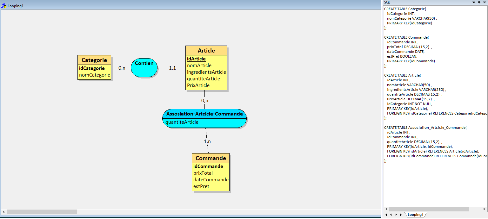

# **Projet : EatSmart**

**Etudiants :** Doriann Bachelet

---

### **1. Description du projet**

Ce projet est un site qui permet aux clients de pouvoir passer des commandes qui seront reçus par des restaurateur

---

### **3. Fonctionnalités principales**

#### **3.1 Frontend (eatSmartFront)**

- **Fonctionnalité 1 :**  
  Afficher le menu
  
- **Fonctionnalité 2 :**  
  Enoyer la commande au Resteaurateur 
  
#### **3.2 Backend (eatSmartBack)**

- **Fonctionnalité 1 :**  
  Recevoir les commandes des clients
  
- **Fonctionnalité 2 :**  
  Avoir un hisotrique des commandes

---

### **4. Technologies utilisées**

- **Frontend :** PHP
- **Backend :** HTML CSS
- **Base de données :** MySQL

---
